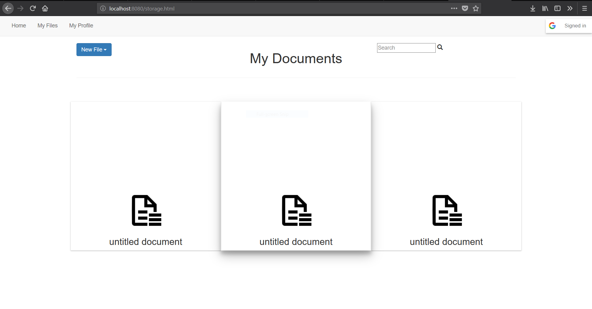

# IntelliText
### A smart text editor built by two high school seniors.

## Steps:
1. Build a Spring MVC Controller
2. Build a Basic Text Editor
3. Login System / User DB and File Directory / Storage DB
4. Annotations and Cards API
5. Polish

### 9/6
First day at work. Started work with the google authentication API.

### 9/14
Login system works, login page looks presentable.

### 9/27
Login system still works. Working on security and file system.

### 10/3
Use an AJAX Post request with Google's tokenID to send to the Controller (Request Mapping) and create the principal object (TODO)

### 11/16

Our User Controller Works, started work on the Storage Controller for sending and recieving files.

### 11/20

Storage page is up and running. Just need to connect it to our storage controller.

### 11/24

Storage page needs more work and the controller points to null files. Bug fixes.

### 11/27

Storage fetch and send now works, Database keeps track of user files. Bug fixes.

### 11/28 

Cards are now representing files on the files page:

